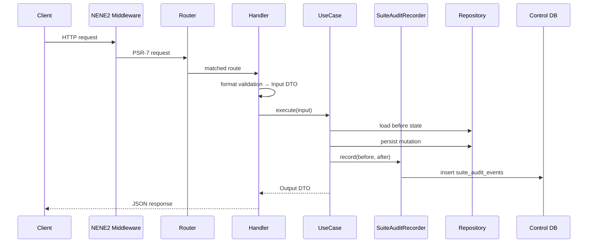

# Backend Standards

NeNe Suite backend is a **NENE2 consumer application** for the apex HTTP API,
installer orchestration, and suite control database. Sibling product domain logic
(billing, reconciliation, CMS, archive) **MUST NOT** appear in this repository.

**Status:** Phase 1 vertical slices land incrementally — catalog read
(✅ `src/AppCatalog/`), install session start/get + control DB + audit recorder
(✅ `src/InstallSession/`, `src/SuiteAudit/`), app-selection with dependency
resolution (✅ `src/AppSelection/`), disclaimer-acceptance + fail
(✅ `src/InstallSession/`), then complete (+ manifest), env generation —
following these rules from the first commit.

**Framework reference:** `vendor/hideyukimori/nene2/docs/` after `composer install`;
sibling checkout at `../NENE2`.

**Reference implementation:** NENE2 `src/Example/Note/` — same Handler → UseCase →
Repository pattern; NeNe Suite namespaces and orchestration domains.

**Inheritance map:** [`../inheritance-from-nene2.md`](../inheritance-from-nene2.md)

**Enforcement level:** violations of placement, layering, dependency direction,
OpenAPI sync, audit recording, or security rules **block merge to `main`**. No
temporary exceptions without an ADR.

---

## Document map

| Section | Covers |
| --- | --- |
| [Principles](#principles) | Non-negotiable values |
| [NENE2 boundary](#nene2-boundary) | Framework vs orchestrator ownership |
| [Repository layout](#repository-layout) | Project tree |
| [Architecture](#architecture) | Request flow, layers, dependencies |
| [Module placement](#module-placement-zero-tolerance) | Domain folders |
| [Naming](#naming-conventions) | Classes, routes, migrations |
| [Handlers](#http-handlers) | Thin HTTP boundary |
| [Use cases](#use-cases) | Orchestration logic + audit |
| [Repositories](#repositories-and-database) | Control DB persistence |
| [DI and routing](#dependency-injection-and-routing) | Wiring |
| [Validation](#validation-layers) | Where rules live |
| [Errors](#errors-and-problem-details) | RFC 9457 |
| [OpenAPI](#openapi) | Contract-first apex API |
| [Installer CLI / Tier B](#installer-cli-and-tier-b) | Non-HTTP orchestration |
| [Testing](#testing) | Pyramid and placement |
| [Security](#security) | API and secrets boundary |
| [CI](#commands-and-ci) | Quality gates |

---

## Principles

| Principle | Meaning |
| --- | --- |
| **Orchestrator only** | Install, env, manifest, audit, apex auth — no Invoice/Clear/Records domain rules |
| **Domain-grouped modules** | Code grouped by orchestration aggregate (`InstallSession/`, `SuiteAudit/`), not by layer |
| **Thin HTTP** | Handlers parse → DTO → use case → JSON response |
| **Use case centric** | Wiring rules, dependency order, audit recording live in use cases |
| **Interface at boundaries** | Repositories and use cases exposed as interfaces; explicit DI |
| **Audit in use cases** | `SuiteAuditRecorder` called from mutating use cases with before/after snapshots |
| **Separate databases** | Suite control DB only here; sibling DB provisioning is name/credential handoff — no cross-DB SQL |
| **Typed boundaries** | Readonly DTOs, enums — not unstructured arrays across layers |
| **Fixed placement** | Mandated paths — **violations block merge** |
| **Secure by default** | Fail closed; secrets never in audit, manifest, or git |

---

## NENE2 boundary

| Owns | Layer |
| --- | --- |
| **NENE2** (`vendor/…/nene2`) | HTTP runtime, Router, middleware, DI, PDO adapters, Problem Details, OpenAPI tooling |
| **NeNe Suite** (`src/`) | Orchestration domains, control DB migrations, apex OpenAPI paths, `SuiteAuditRecorder`, installer commands |
| **Sibling products** | All domain tables, domain audit, product OpenAPI |

Do **not** copy NENE2 `src/Middleware/`, `src/Routing/`, etc. into `src/`.
Do **not** ship NENE2 Example routes in production suite builds.

---

## Repository layout

```text
nene-suite/
  composer.json                 # require hideyukimori/nene2; PSR-4 NeNeSuite\ → src/
  phinx.php                     # nene_suite control DB only
  phpunit.xml.dist
  phpstan.neon.dist
  .php-cs-fixer.php
  catalog/
    apps.json                   # authoritative app list
    apps.schema.json
  schema/
    suite-audit-event.schema.json
    install-manifest.schema.json   # Phase 1+
  public_html/
    index.php                   # apex front controller
    openapi.php
  src/
    InstallSession/
    AppSelection/
    SuiteEnv/
    IntegrationWiring/
    InstallManifest/
    SuiteAudit/
    AppCatalog/
    ApplicationServiceProvider.php
    Http/
      RuntimeContainerFactory.php
  tools/
    installer/                  # Tier B CLI / compose helpers — thin; call use cases when PHP runtime exists
    check-terminology.sh
  tests/
    InstallSession/
    SuiteAudit/
    OpenApi/
  database/
    migrations/                 # suite_audit_events, install_sessions, …
    schema/
  docs/
    openapi/openapi.yaml
  frontend/                     # Phase 1+ — see frontend-standards.md
```

---

## Architecture

### Request flow



### Layer dependency graph

```text
Handler → UseCaseInterface → RepositoryInterface → PdoRepository → DatabaseQueryExecutorInterface (NENE2)
         ↓
    SuiteAuditRecorder (interface) → PdoSuiteAuditRecorder
         ↓
    Input/Output DTOs, domain exceptions
```

**Hard rules:**

- **Downward only** — repositories never call use cases; handlers never call repositories or audit recorder directly.
- **No sideways** — `InstallSession/` must not import `SuiteAudit/` internals; share via interfaces or application-level use cases with ADR.
- **Framework up** — application code imports `Nene2\…`; NENE2 never imports `NeNeSuite\…`.
- **No sibling domain imports** — do not `require` nene-invoice source for business rules; HTTP + catalog metadata only.

### Validation split

| Layer | Validates |
| --- | --- |
| **Middleware** | Auth, size limits, CORS, request id (NENE2) |
| **Handler** | JSON shape, formats → `ValidationException` |
| **Use case** | Catalog dependency order, duplicate install, integration policy, audit mandatory fields |
| **Repository** | Nothing — persist and retrieve only |

---

## Module placement (zero tolerance)

Each **orchestration aggregate** gets one folder under `src/` in **PascalCase**.

**Do not** create `src/UseCases/`, `src/Handlers/`, or `src/Repositories/`.

### Canonical domain tree (example: `InstallSession/`)

```text
src/InstallSession/
  InstallSession.php                      # optional domain object
  InstallSessionNotFoundException.php
  StartInstallSessionInput.php
  StartInstallSessionOutput.php
  CompleteInstallSessionInput.php
  CompleteInstallSessionOutput.php
  StartInstallSessionUseCaseInterface.php
  StartInstallSessionUseCase.php
  CompleteInstallSessionUseCase.php
  InstallSessionRepositoryInterface.php
  PdoInstallSessionRepository.php
  StartInstallSessionHandler.php
  CompleteInstallSessionHandler.php
  InstallSessionNotFoundExceptionHandler.php
  InstallSessionRouteRegistrar.php
  InstallSessionServiceProvider.php
```

### Suite domain modules (mandatory grouping)

| Domain folder | Responsibility |
| --- | --- |
| `AppCatalog/` | Read/validate `catalog/apps.json`; dependency graph |
| `AppSelection/` | Operator-selected app subset; resolution order |
| `InstallSession/` | Wizard lifecycle (start / complete / fail) |
| `SuiteEnv/` | Generate sanitized `NENE_SUITE_*` maps (secrets handled separately) |
| `IntegrationWiring/` | Enable/disable documented HTTP integrations |
| `InstallManifest/` | Manifest create/update; no secrets |
| `SuiteAudit/` | `SuiteAuditRecorder`, event persistence, sanitization presenters |
| `DatabaseProvision/` | Per-app DB **name** provisioning metadata (not sibling schema) |

New domains require Issue + update this table + `naming-conventions.md`.

### Placement matrix (mandatory)

| Artifact | Required path | May depend on |
| --- | --- | --- |
| Input DTO | `src/{Domain}/{Operation}Input.php` | primitives, enums |
| Output DTO | `src/{Domain}/{Operation}Output.php` | same |
| Use case interface | `src/{Domain}/{Operation}UseCaseInterface.php` | Input/Output |
| Use case impl | `src/{Domain}/{Operation}UseCase.php` | repository interfaces, `SuiteAuditRecorderInterface` |
| Repository interface | `src/{Domain}/{Entity}RepositoryInterface.php` | domain types |
| PDO repository | `src/{Domain}/Pdo{Entity}Repository.php` | NENE2 DB executors |
| HTTP handler | `src/{Domain}/{Operation}Handler.php` | use case interface |
| Exception → HTTP | `src/{Domain}/{Exception}Handler.php` | Problem Details factory |
| Route registrar | `src/{Domain}/{Entity}RouteRegistrar.php` | handlers |
| Service provider | `src/{Domain}/{Entity}ServiceProvider.php` | NENE2 DI |
| Audit recorder | `src/SuiteAudit/SuiteAuditRecorder.php` | sanitizers only |
| Migrations | `database/migrations/` | Phinx |
| Schema snapshot | `database/schema/{table}.sql` | matches migration |
| OpenAPI | `docs/openapi/openapi.yaml` | — |
| Use case test | `tests/{Domain}/{Operation}UseCaseTest.php` | in-memory doubles |
| Repository test | `tests/{Domain}/Pdo{Entity}RepositoryTest.php` | SQLite `:memory:` |

### Forbidden placements (automatic PR reject)

- Sibling domain logic (tax, billing, reconciliation, CMS entities)
- Business logic in handlers beyond format validation
- SQL outside `Pdo*Repository.php`
- PDO or `DatabaseQueryExecutorInterface` in use cases or handlers
- Use cases accepting `ServerRequestInterface` or raw `$_ENV`
- Mutating use case **without** audit record (when `audit-trail.md` §1 requires it)
- Secrets in audit JSON, manifest, or OpenAPI examples
- Layer-grouped directories (`src/Controllers/`)
- Cross-database writes into sibling app databases

---

## Naming conventions

> **Full rules:** [`naming-conventions.md`](./naming-conventions.md)

| Artifact | Pattern | Example |
| --- | --- | --- |
| Namespace | `NeNeSuite\{Domain}\` | `NeNeSuite\InstallSession\StartInstallSessionHandler` |
| Use case | `{Verb}{Entity}UseCase` + `Interface` | `CompleteInstallSessionUseCaseInterface` |
| Handler | `{Verb}{Entity}Handler` | `StartInstallSessionHandler` |
| Audit recorder | `SuiteAuditRecorder` / `Interface` | — |
| Migration | `YYYYMMDDHHMMSS_snake_description.php` | `20260529000000_create_suite_audit_events_table.php` |
| API path | `/api/v1/...` kebab-case | `/api/v1/install-sessions` |
| `operationId` | camelCase | `startInstallSession` |

PHP defaults inherited from NENE2: `strict_types`, PHP 8.4+, `final readonly` DTOs, PSR-12, constructor injection only.

---

## HTTP handlers

Handlers are the **only** layer that touches PSR-7.

1. Parse body / path params via NENE2 helpers (`JsonRequestBodyParser`, `Router::PARAMETERS_ATTRIBUTE`)
2. Format validation → `ValidationException`
3. Map to Input DTO
4. Call `$useCase->execute($input)`
5. Map Output DTO → JSON via `JsonResponseFactory`

**Forbidden:** repository calls, audit calls, orchestration rules, SQL, `$request->getAttribute('id')` for path params.

Reference: `../NENE2/src/Example/Note/CreateNoteHandler.php`

---

## Use cases

One operation = one interface with single `execute()` method.

### Rules

- `final readonly class` implementation
- Constructor: repository interfaces + `SuiteAuditRecorderInterface` for mutating flows
- Load sanitized **before** state before mutation when entity pre-exists
- Persist mutation + audit in **one transaction** when using control DB
- Throw domain exceptions for actionable failures
- Return typed Output DTO
- **No** HTTP, PDO, container, raw env access

### Audit obligation

Every mutating orchestration use case listed in [`audit-trail.md`](../explanation/audit-trail.md) §4 **MUST**:

```php
$this->audit->record(new RecordSuiteAuditEventCommand(
    suiteId: $input->suiteId,
    action: 'app_selection.changed',
    entityType: 'app_selection',
    entityId: $sessionId,
    beforeJson: $before,
    afterJson: $after,
    actorUserId: $input->actorUserId,
    source: 'installer_ui',
    installSessionId: $sessionId,
));
```

Use `SuiteAuditSanitizer` (same presenters as operator export) — never raw env arrays with secrets.

Reference: nene-invoice ADR 0008, nene-vault ADR 0014, suite ADR 0007.

---

## Repositories and database

### Control database only

- Database name: **`nene_suite`** (config via `NENE_SUITE_CONTROL_DATABASE_URL`)
- Tables: `suite_audit_events`, install session state, manifest metadata — **not** sibling domain tables
- Inject `DatabaseQueryExecutorInterface` into `Pdo*Repository` only
- Parameterized queries only

### Migrations (Phinx)

- `database/migrations/` + `database/schema/{table}.sql` snapshot per table
- Reversible migrations or documented rollback
- Register new tables in [`schema-conventions.md`](./schema-conventions.md)

### Issue Phase 1 tables (minimum)

| Table | Purpose |
| --- | --- |
| `suite_audit_events` | Append-only audit ([`audit-trail.md`](../explanation/audit-trail.md)) |
| `install_sessions` | Wizard state machine |
| `install_manifests` | Manifest snapshots (optional if file-only — ADR decides) |

---

## Dependency injection and routing

- Each domain: `ServiceProviderInterface` with explicit factory closures — **no autowiring**
- Register route registrar keys: `'nene-suite.route_registrar.{domain}'`
- `ApplicationServiceProvider` aggregates domain providers — no business logic
- `src/Http/RuntimeContainerFactory.php` builds container; `public_html/index.php` is front controller only

Reference: NENE2 `NoteServiceProvider`, `docs/development/http-runtime.md`

---

## Validation layers

| Concern | Where |
| --- | --- |
| Missing JSON field | Handler |
| Invalid ULID / catalog id format | Handler |
| Dependency cycle in app selection | Use case (`AppCatalog` interface) |
| Integration enabled without Invoice | Use case |
| Disclaimer not accepted before complete | Use case |

Public validation codes: **English**. See NENE2 `request-validation.md`.

---

## Errors and Problem Details

- RFC 9457 via NENE2 `ProblemDetailsResponseFactory`
- Application `type`: `https://nene-suite.dev/problems/{problem-name}`
- Validation: `validation-failed` + structured `errors`
- Never expose stack traces, SQL, paths, secrets
- Register domain exception handlers in domain service provider

---

## OpenAPI

- Source of truth: `docs/openapi/openapi.yaml`
- Every shipped JSON endpoint: `operationId`, success schema, Problem Details responses
- Served via `public_html/openapi.php`
- Validate: `composer openapi`

Endpoint **not done** until: route + handler + use case + repository (if persistent) + OpenAPI + tests + audit actions registered.

---

## Installer CLI and Tier B

Non-HTTP install paths (`tools/installer/`) **MUST** call the same use cases as the HTTP API — no duplicated orchestration logic in shell.

| Layer | Allowed |
| --- | --- |
| `tools/installer/*.sh` | Docker Compose, file permissions, subprocess spawn |
| `tools/installer/*.php` | Thin CLI entry → bootstrap container → invoke use case |
| Shell scripts | **Must not** embed dependency resolution, env generation, or audit rules |

Tier B compose files live under `tools/installer/compose/` — document ports in README, not secrets.

---

## Testing

| Level | Scope | Required when |
| --- | --- | --- |
| Use case unit | In-memory repos + fake audit recorder | Every mutating use case |
| Repository | SQLite `:memory:` | Every PDO repository |
| HTTP | Handler or runtime factory | Every handler group |
| OpenAPI contract | `tests/OpenApi/` | Public endpoints |
| Catalog schema | Validate `catalog/apps.json` | CI (Issue #9) |
| PHPStan | Level 8 on `src/` | All PRs |

Audit tests **MUST** assert: correct `action`, non-null sanitized snapshots, no secret keys in recorded JSON.

Reference: NENE2 `tests/Example/Note/`

---

## Security

| Topic | Rule |
| --- | --- |
| Secrets | Never in repo, manifest, audit, or OpenAPI examples |
| Auth | NENE2 middleware for apex admin routes |
| SQL | Parameterized only |
| Cross-DB | Provision sibling DBs via documented env — no suite SQL into app DBs |
| Debug | `APP_DEBUG` controls verbosity — off in production docs |

---

## Commands and CI

```bash
composer check
composer test
composer analyse
composer cs
composer openapi
composer catalog:validate   # Phase 1+
bash tools/check-terminology.sh
```

### Required before merge (PHP PRs)

1. `composer check` green (when scaffold exists)
2. OpenAPI updated for changed endpoints
3. Tests for touched use cases; audit assertions when mutating
4. `audit-trail.md` §4 updated for new actions
5. Terminology + schema conventions respected

---

## Non-goals

- Forking NENE2 into `src/`
- Laravel/Symfony full stack
- Shared DB with sibling apps
- Domain audit replacement for Invoice/Clear/Vault
- Vendoring sibling product source trees

---

## Related documents

- Index: `docs/development/coding-standards.md`
- Frontend: `docs/development/frontend-standards.md`
- Schema: `docs/development/schema-conventions.md`
- Self-review: `docs/review/backend-api.md`
- Compliance: `docs/explanation/orchestration-compliance.md`, `docs/explanation/audit-trail.md`
- NENE2: `../NENE2/docs/development/domain-layer.md`

Last updated: 2026-05-29
