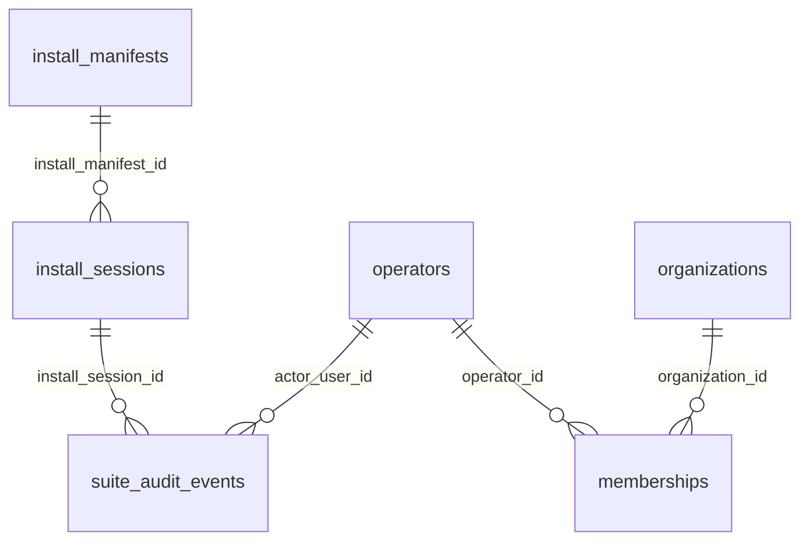

# Control DB schema reference

> **Generated — do not edit by hand.** Run `composer schema:docs` to regenerate;
> `composer schema:docs:check` enforces coverage + freshness in CI.
> Source: `database/schema/*.sql` (the same descriptions become MySQL/PostgreSQL
> `COMMENT`s via the schema-comment migration — see ADR 0016 / ADR 0014).

Suite control database (`nene_suite`). Sibling application data lives in each
product database, not here.

## Tables

### Auth

- [`login_attempts`](#login_attempts) — Fixed-window login rate-limit counters. One row per attempt_key; ephemeral, reclaimed by opportunistic GC.
- [`operators`](#operators) — Apex login shell accounts (operators). password_hash is a bcrypt/argon hash, never plaintext.
- [`revoked_tokens`](#revoked_tokens) — Logout/revocation denylist of JWT jti values. Ephemeral; rows reclaimed once expires_at passes.

### Tenancy

- [`memberships`](#memberships) — Operator-to-organization role assignments. organization_id is NULL for the platform superadmin; unique per (operator_id, organization_id).
- [`organizations`](#organizations) — Suite tenancy registry (SSOT). external_id is the federation UUID propagated to sibling apps; rows are status-flagged, never hard-deleted.

### Install

- [`install_manifests`](#install_manifests) — Point-in-time install snapshots (JSON, no secrets) for audit alignment and operator export. content_hash is the SHA-256 of content_json.
- [`install_sessions`](#install_sessions) — Installer run state (Tier B). One row per install run: in_progress to completed or failed. Holds no secrets.

### Audit

- [`suite_audit_events`](#suite_audit_events) — Append-only audit trail of mutating suite actions (ADR 0007). before_json/after_json are sanitized snapshots with secrets redacted.

### Federation

- [`federation_signing_keys`](#federation_signing_keys) — Federation IdP signing keys: public JWK only (private key never stored). Exactly one row is active; status drives JWKS publication.

### Deploy

- [`deploy_requests`](#deploy_requests) — Deploy-control seam queue (ADR 0019 OQ1, S2-1a / #361): one row per "recreate service X at image digest D" request handed to the host-side deploy agent. The suite writes pending rows and records the agent-reported terminal result; the compose pull + recreate itself runs on the host, never in the suite container. Disabled-degrade: no rows are ever created while the capability flag is off.

### Origin

- [`installed_app_versions`](#installed_app_versions) — Last-known installed version per suite-managed product, learned from the sibling /health probe (#255, epic #251 prerequisite). Supplies the installed version to the Origin update aggregator so a verified latest version can be diffed (unknown -> up_to_date / update_available / forced) instead of surfaced latest-only. Last-write-wins; absence of a row means the version is unknown.
- [`origin_gen_watermarks`](#origin_gen_watermarks) — Profiled-TUF anti-rollback generation watermark for the Origin read model (ADR 0017 §5). One row per tree coordinate, advanced monotonically; supplies persisted_gen to the consumer verifier so a replayed older current fails closed.

## Relationships

Logical references only — the control DB declares no physical foreign keys
(cross-DB FKs are prohibited; intra-DB references are enforced in the use-case layer).

## `deploy_requests`

_Group: Deploy_

Deploy-control seam queue (ADR 0019 OQ1, S2-1a / #361): one row per "recreate service X at image digest D" request handed to the host-side deploy agent. The suite writes pending rows and records the agent-reported terminal result; the compose pull + recreate itself runs on the host, never in the suite container. Disabled-degrade: no rows are ever created while the capability flag is off.

| Column | Type | Null | Key | Description |
| --- | --- | --- | --- | --- |
| `id` | `CHAR(26)` | NO | PK | ULID primary key. |
| `service` | `VARCHAR(100)` | NO |  | Catalog app id (explicit allow-list; matches catalog/apps.json id). |
| `image_digest` | `VARCHAR(96)` | NO |  | Immutable image pin, sha256:<64 hex> (ADR 0019 OQ2 stage 1). Never a mutable tag. |
| `status` | `VARCHAR(16)` | NO |  | Lifecycle: pending \| succeeded \| failed. Terminal states are agent-reported. |
| `requested_by` | `CHAR(26)` | YES |  | Requesting operator ULID. Requests are operator-initiated (superadmin surface). |
| `detail` | `TEXT` | YES |  | Agent-reported outcome detail (failure reason etc.). NULL until terminal. |
| `created_at` | `VARCHAR(32)` | NO |  | Request time, ISO-8601 UTC string. |
| `updated_at` | `VARCHAR(32)` | NO |  | Last transition time, ISO-8601 UTC string. |
| `completed_at` | `VARCHAR(32)` | YES |  | Terminal report time, ISO-8601 UTC string. NULL while pending. |

### Indexes

- `idx_deploy_requests_status_created_at` (index) on `status, created_at`

## `federation_signing_keys`

_Group: Federation_

Federation IdP signing keys: public JWK only (private key never stored). Exactly one row is active; status drives JWKS publication.

| Column | Type | Null | Key | Description |
| --- | --- | --- | --- | --- |
| `id` | `CHAR(26)` | NO | PK | ULID primary key. |
| `kid` | `VARCHAR(64)` | NO |  | Key id: RFC 7638 JWK thumbprint. Unique. |
| `alg` | `VARCHAR(16)` | NO |  | Signing algorithm: ES256 (current). Extensible. |
| `public_jwk` | `TEXT` | NO |  | Public key as a JWK JSON object. Never contains private key material. |
| `status` | `VARCHAR(16)` | NO |  | Lifecycle: active \| retiring \| retired \| revoked. Drives JWKS publication. |
| `created_at` | `VARCHAR(32)` | NO |  | Key generation time, ISO-8601 UTC string. |
| `activated_at` | `VARCHAR(32)` | YES |  | When the key became active, ISO-8601 UTC string. NULL until activated. |
| `retired_at` | `VARCHAR(32)` | YES |  | When the key was retired/revoked, ISO-8601 UTC string. NULL otherwise. |

### Indexes

- `idx_federation_signing_keys_kid` (UNIQUE) on `kid`
- `idx_federation_signing_keys_status` (index) on `status`

## `install_manifests`

_Group: Install_

Point-in-time install snapshots (JSON, no secrets) for audit alignment and operator export. content_hash is the SHA-256 of content_json.

| Column | Type | Null | Key | Description |
| --- | --- | --- | --- | --- |
| `id` | `CHAR(26)` | NO | PK | ULID primary key. |
| `suite_id` | `CHAR(26)` | NO |  | Suite installation id (logical ref install_sessions.suite_id). |
| `content_json` | `TEXT` | NO |  | Manifest body as JSON (suite_id, installed_at, app_versions, org_external_id, enabled_integrations, ...). No secrets. |
| `content_hash` | `VARCHAR(64)` | NO |  | SHA-256 hex of content_json for audit alignment and change detection. |
| `created_at` | `VARCHAR(32)` | NO |  | Manifest creation time, ISO-8601 UTC string. |

### Indexes

- `idx_install_manifests_suite_id` (index) on `suite_id`

## `install_sessions`

_Group: Install_

Installer run state (Tier B). One row per install run: in_progress to completed or failed. Holds no secrets.

| Column | Type | Null | Key | Description |
| --- | --- | --- | --- | --- |
| `id` | `CHAR(26)` | NO | PK | ULID primary key. |
| `suite_id` | `CHAR(26)` | NO |  | Suite installation id (matches NENE_SUITE_ID and manifest suite_id). |
| `status` | `VARCHAR(32)` | NO |  | Installer workflow state: in_progress \| completed \| failed. |
| `tier` | `VARCHAR(8)` | NO |  | Deployment tier: B (Docker/VPS, current) \| A (shared hosting, planned). |
| `catalog_revision` | `INTEGER` | NO |  | App-catalog schema revision captured at install start. |
| `selected_apps_json` | `TEXT` | NO |  | JSON array of selected catalog ids (dependency-resolved). |
| `database_targets_json` | `TEXT` | YES |  | JSON array of per-app database target overrides (ADR 0022 mode A). NULL/[] = env/default targets. |
| `disclaimer_accepted` | `INTEGER DEFAULT 0` | NO |  | Whether the operator accepted the installer disclaimer (0/1). |
| `disclaimer_accepted_at` | `VARCHAR(32)` | YES |  | When the disclaimer was accepted, ISO-8601 UTC string. NULL until accepted. |
| `org_external_id` | `CHAR(26)` | YES |  | Federation UUID (ULID) chosen for the organization. NULL until set. |
| `org_display_name` | `VARCHAR(500)` | YES |  | Operator-entered organization name. NULL until set. |
| `install_manifest_id` | `CHAR(26)` | YES |  | Manifest produced on completion (logical ref install_manifests.id). NULL until completed. |
| `failure_code` | `VARCHAR(64)` | YES |  | Machine-readable error code when status=failed. NULL otherwise. |
| `created_at` | `VARCHAR(32)` | NO |  | Session creation time, ISO-8601 UTC string. |
| `updated_at` | `VARCHAR(32)` | NO |  | Last state-change time, ISO-8601 UTC string. |
| `completed_at` | `VARCHAR(32)` | YES |  | Completion time, ISO-8601 UTC string. NULL until completed. |

### Indexes

- `idx_install_sessions_suite_id` (index) on `suite_id`
- `idx_install_sessions_status` (index) on `status`

## `installed_app_versions`

_Group: Origin_

Last-known installed version per suite-managed product, learned from the sibling /health probe (#255, epic #251 prerequisite). Supplies the installed version to the Origin update aggregator so a verified latest version can be diffed (unknown -> up_to_date / update_available / forced) instead of surfaced latest-only. Last-write-wins; absence of a row means the version is unknown.

| Column | Type | Null | Key | Description |
| --- | --- | --- | --- | --- |
| `catalog_id` | `VARCHAR(100)` | NO | PK | Catalog product slug (matches catalog/apps.json id). |
| `version` | `VARCHAR(64)` | NO |  | Installed semver as reported by the sibling /health version field. |
| `checked_at` | `VARCHAR(32)` | NO |  | Last successful probe time, ISO-8601 UTC string. |

## `login_attempts`

_Group: Auth_

Fixed-window login rate-limit counters. One row per attempt_key; ephemeral, reclaimed by opportunistic GC.

| Column | Type | Null | Key | Description |
| --- | --- | --- | --- | --- |
| `attempt_key` | `VARCHAR(160)` | NO | PK | Rate-limit key and primary key, e.g. ip:192.0.2.1. |
| `window_started_at` | `BIGINT` | NO |  | Start of the current fixed window, epoch seconds (BIGINT). |
| `attempt_count` | `INT` | NO |  | Failed-attempt count within the current window. |

### Indexes

- `idx_login_attempts_window` (index) on `window_started_at`

## `memberships`

_Group: Tenancy_

Operator-to-organization role assignments. organization_id is NULL for the platform superadmin; unique per (operator_id, organization_id).

| Column | Type | Null | Key | Description |
| --- | --- | --- | --- | --- |
| `id` | `CHAR(26)` | NO | PK | ULID primary key. |
| `operator_id` | `CHAR(26)` | NO |  | Operator this membership belongs to (logical ref operators.id; no cross-DB FK). |
| `organization_id` | `CHAR(26)` | YES |  | Organization scope (logical ref organizations.id). NULL = platform-level superadmin. |
| `role` | `VARCHAR(32)` | NO |  | Role: superadmin (platform, org NULL) \| admin \| member \| viewer (org-scoped). |
| `created_at` | `VARCHAR(32)` | NO |  | Record creation time, ISO-8601 UTC string. |
| `updated_at` | `VARCHAR(32)` | NO |  | Last modification time, ISO-8601 UTC string. |

### Indexes

- `idx_memberships_operator_org` (UNIQUE) on `operator_id, organization_id`
- `idx_memberships_organization` (index) on `organization_id`

## `operators`

_Group: Auth_

Apex login shell accounts (operators). password_hash is a bcrypt/argon hash, never plaintext.

| Column | Type | Null | Key | Description |
| --- | --- | --- | --- | --- |
| `id` | `CHAR(26)` | NO | PK | ULID primary key. |
| `email` | `VARCHAR(320)` | NO |  | Login email address. Unique (idx_operators_email). |
| `password_hash` | `VARCHAR(255)` | NO |  | Bcrypt/argon password hash. Never plaintext; never logged, audited, or exported. |
| `display_name` | `VARCHAR(320)` | YES |  | Optional human-readable operator name. |
| `created_at` | `VARCHAR(32)` | NO |  | Record creation time, ISO-8601 UTC string. |
| `updated_at` | `VARCHAR(32)` | NO |  | Last modification time, ISO-8601 UTC string. |

### Indexes

- `idx_operators_email` (UNIQUE) on `email`

## `organizations`

_Group: Tenancy_

Suite tenancy registry (SSOT). external_id is the federation UUID propagated to sibling apps; rows are status-flagged, never hard-deleted.

| Column | Type | Null | Key | Description |
| --- | --- | --- | --- | --- |
| `id` | `CHAR(26)` | NO | PK | ULID primary key. |
| `external_id` | `CHAR(26)` | NO |  | Federation UUID (org_external_id in JWT claims), propagated to sibling apps. Unique. |
| `name` | `VARCHAR(320)` | NO |  | Organization display name (operator-settable). |
| `slug` | `VARCHAR(160)` | NO |  | URL-safe identifier for per-organization resolution (path/subdomain). Unique. |
| `status` | `VARCHAR(32)` | NO |  | Lifecycle state: active \| disabled. Never hard-deleted (ADR 0012). |
| `created_at` | `VARCHAR(32)` | NO |  | Record creation time, ISO-8601 UTC string. |
| `updated_at` | `VARCHAR(32)` | NO |  | Last modification time, ISO-8601 UTC string. |

### Indexes

- `idx_organizations_external_id` (UNIQUE) on `external_id`
- `idx_organizations_slug` (UNIQUE) on `slug`

## `origin_gen_watermarks`

_Group: Origin_

Profiled-TUF anti-rollback generation watermark for the Origin read model (ADR 0017 §5). One row per tree coordinate, advanced monotonically; supplies persisted_gen to the consumer verifier so a replayed older current fails closed.

| Column | Type | Null | Key | Description |
| --- | --- | --- | --- | --- |
| `coordinate` | `VARCHAR(255)` | NO | PK | Tree coordinate the watermark belongs to: update:{product} \| feed:{product}/{audience}/{locale} \| entitlement:{product}/{audience}. Origin numbers gen independently per coordinate, so one row per product would pin unrelated trees above their own gen and reject them as rollback. |
| `gen` | `BIGINT` | NO |  | Highest accepted profiled-TUF generation at this coordinate; advanced monotonically (never regresses). |
| `updated_at` | `VARCHAR(32)` | NO |  | Last advance time, ISO-8601 UTC string. |

## `revoked_tokens`

_Group: Auth_

Logout/revocation denylist of JWT jti values. Ephemeral; rows reclaimed once expires_at passes.

| Column | Type | Null | Key | Description |
| --- | --- | --- | --- | --- |
| `jti` | `CHAR(26)` | NO | PK | JWT jti claim and primary key (ULID). Revocation is idempotent. |
| `token_type` | `VARCHAR(32)` | NO |  | Revoked token type: apex_session (current). Extensible. |
| `expires_at` | `BIGINT` | NO |  | Token exp time, epoch seconds (BIGINT). Used for GC. |
| `revoked_at` | `VARCHAR(32)` | NO |  | When revocation was recorded, ISO-8601 UTC string. |
| `reason` | `VARCHAR(64)` | NO |  | Revocation reason, e.g. logout. Extensible. |

### Indexes

- `idx_revoked_tokens_expires` (index) on `expires_at`

## `suite_audit_events`

_Group: Audit_

Append-only audit trail of mutating suite actions (ADR 0007). before_json/after_json are sanitized snapshots with secrets redacted.

| Column | Type | Null | Key | Description |
| --- | --- | --- | --- | --- |
| `id` | `CHAR(26)` | NO | PK | ULID primary key. |
| `suite_id` | `CHAR(26)` | NO |  | Suite installation id (matches NENE_SUITE_ID). |
| `org_external_id` | `CHAR(26)` | YES |  | Federation UUID when known; NULL for pre-auth wizard events. |
| `actor_user_id` | `CHAR(26)` | YES |  | Authenticated operator id (logical ref operators.id); NULL for pre-auth or system events. |
| `actor_label` | `VARCHAR(320)` | YES |  | Human-readable actor label (e.g. operator email at disclaimer step). No secrets. |
| `action` | `VARCHAR(128)` | NO |  | Action as {entity}.{verb}, e.g. install_session.completed, membership.granted. See audit-trail.md. |
| `entity_type` | `VARCHAR(64)` | NO |  | Affected entity category, e.g. install_session \| organization \| membership \| federation_signing_key. See audit-trail.md. |
| `entity_id` | `VARCHAR(64)` | NO |  | Stable id of the affected entity (ULID, suite_id, or other domain key). |
| `before_json` | `TEXT` | YES |  | Sanitized state before the change as JSON; NULL on create. Secrets redacted. |
| `after_json` | `TEXT` | YES |  | Sanitized state after the change as JSON; NULL when policy allows. Secrets redacted. |
| `created_at` | `VARCHAR(32)` | NO |  | Server-generated event time, ISO-8601 UTC string. |
| `source` | `VARCHAR(32)` | NO |  | Origin: installer_ui \| installer_cli \| apex_admin \| system \| api. |
| `request_id` | `VARCHAR(128)` | YES |  | Correlation id from the X-Request-Id header when present. NULL otherwise. |
| `install_session_id` | `CHAR(26)` | YES |  | Groups wizard steps of one install run (logical ref install_sessions.id). NULL otherwise. |
| `metadata_json` | `TEXT` | YES |  | Event-specific extras as JSON (e.g. failure reason, dependency list). Sanitized. |

### Indexes

- `idx_suite_audit_events_suite_id` (index) on `suite_id`
- `idx_suite_audit_events_install_session_id` (index) on `install_session_id`
- `idx_suite_audit_events_action` (index) on `action`

